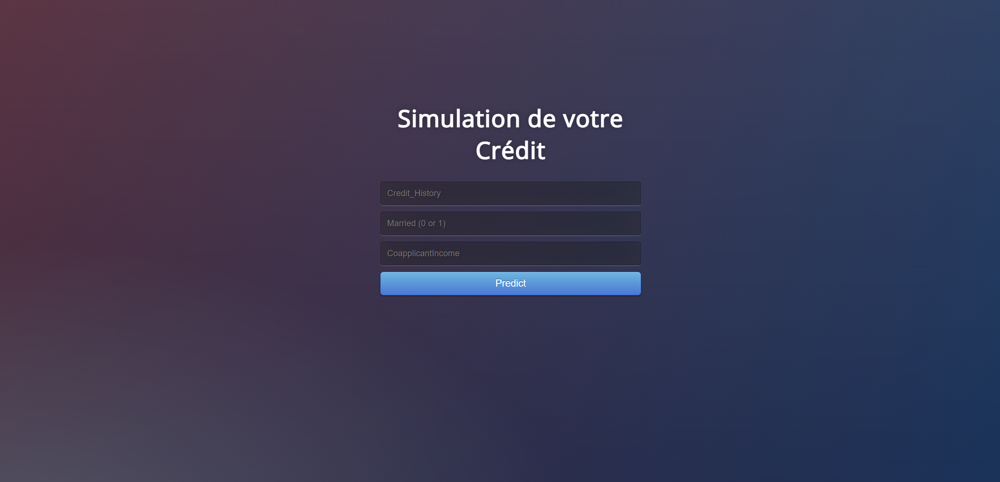

# Crédit Prediction App

This repository contains a **credit prediction application** that uses machine learning models to predict loan eligibility based on user inputs. The web interface, built with Flask, allows users to interact with the model seamlessly. The app uses **Logistic Regression, K-Nearest Neighbors (KNN)**, and **Decision Tree** models for predictions and is **containerized with Docker** to ensure portability and scalability.

You can find the **training dataset here**: [Loan Prediction Dataset on Kaggle](https://www.kaggle.com/datasets/altruistdelhite04/loan-prediction-problem-dataset).

For detailed model development steps, refer to the **`credit_model.ipynb` notebook**.

---

## Table of Contents

- [Features](#features)  
- [Technologies Used](#technologies-used)  
- [Example Prediction Interface](#example-prediction-interface)  
- [Installation](#installation)  
  - [1. Clone the Repository](#1-clone-the-repository)  
  - [2. Place the Model File](#2-place-the-model-file)  
  - [3. Install Dependencies (if running locally)](#3-install-dependencies-if-running-locally)  
- [Usage](#usage)  
- [Deployment](#deployment)  
  - [Local Deployment with Docker](#local-deployment-with-docker)  
  - [Access the Application](#3-access-the-application)  
- [Project Structure](#project-structure)  
- [Contributing](#contributing)  
- [Acknowledgments](#acknowledgments)  
- [License](#license)

---

## Features

- **Multi-Model Approach**: Implements Logistic Regression, K-Nearest Neighbors, and Decision Tree algorithms for reliable predictions.  
- **Interactive Web Interface**: Users can enter personal data (credit history, marital status, income) to predict loan eligibility.  
- **Dockerized Application**: Simplifies deployment and ensures consistency across environments.  
- **Pre-trained Model Integration**: Models are saved and loaded using **pickle** for fast inference.  

---

## Technologies Used

- **Programming Language**: Python 3.x  
- **Python Libraries**:
  - Data Handling: `numpy`, `pandas`
  - Machine Learning: `scikit-learn` (Logistic Regression, KNN, Decision Tree)
  - Model Persistence: `pickle`
  - Web Framework: Flask  
- **Containerization**: Docker  
- **HTML/CSS**: For front-end design (via Flask templates).

---

## Example Prediction Interface

Here’s a preview of the web interface:



---

## Installation

### 1. Clone the Repository

```bash
git clone https://github.com/merouane-bn/Credit_Prediction.git
cd Credit_Prediction
```

### 2. Place the Model File

Make sure your **`model.pkl`** (trained machine learning model) is in the root directory of the project.

### 3. Install Dependencies (if running locally)

If you want to run the app without Docker:

```bash
pip install -r requirements.txt
```

---

## Usage

1. **Run the Flask app locally**:
   ```bash
   python app.py
   ```
2. **Open the web browser** and navigate to:
   ```
   http://127.0.0.1:5000
   ```
3. **Enter data** in the form:
   - **Credit History**: 0 or 1  
   - **Married**: 0 (No) or 1 (Yes)  
   - **Coapplicant Income**: Numeric value

4. **Click "Predict"** to see the loan eligibility result.

---

## Deployment

### Local Deployment with Docker

#### 1. Build the Docker Image

```bash
docker build -t credit-prediction-app .
```

#### 2. Run the Docker Container

```bash
docker run -p 5000:5000 credit-prediction-app
```

Alternatively, use **Docker Compose**:

```bash
docker-compose up --build
```

#### 3. Access the Application

Open your browser and go to:  
`http://localhost:5000`

---

## Project Structure

```
/Credit_Prediction
│
├── app.py                 # Flask application
├── Dockerfile             # Docker configuration
├── docker-compose.yml     # Optional: Docker Compose file
├── requirements.txt       # Python dependencies
├── model.pkl              # Trained machine learning model
├── credit_model.ipynb     # Jupyter notebook with model training code
├── templates/             # HTML templates for the web interface
│   └── index.html         # Main page with the form
└── static/                # Static files (CSS, images)
```

---

## Contributing

Contributions are welcome!  

1. **Fork this repository**.  
2. Create a new branch for your feature:
   ```bash
   git checkout -b feature-branch
   ```
3. **Commit your changes** and push them:
   ```bash
   git commit -m "Add new feature"
   git push origin feature-branch
   ```
4. **Open a pull request**.

Ensure your code follows best practices and is well-documented.

---

## Acknowledgments

- **Kaggle**: For providing the [Loan Prediction Dataset](https://www.kaggle.com/datasets/altruistdelhite04/loan-prediction-problem-dataset).  
- **Flask**: For the lightweight web framework.  
- **Docker**: For enabling easy deployment.  
- **scikit-learn**: For the machine learning models.

---

## License

This project is licensed under the **MIT License** - see the [LICENSE](LICENSE) file for details.

---
